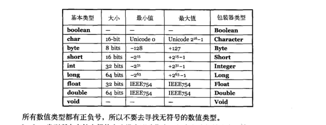

#### 存储到什么地方
 程序运行时,对系那个是怎么进行放置安排的呢? 特别是内存是怎么分配的呢?对这些方面的了解会对你有很大的帮助.有五个不同的地方可以存放数据:
 * #####寄存器
        这是最快的存储区,因为它位于不同与其他存储区的地方---处理器内部.但是寄  
        存器的数量极其有限,所以寄存器根据需求进行分配.你不能直接控制,也不能在
        程序中感觉到寄存器的存在的任何现象(另一方面,C 和 C++ 允许您向编译器建议寄存器的分配方法).
 * #####堆栈
        位于通用RAM(随机访问寄存器中),但通过堆栈指针可以从处理器那里获得
        直接支持.堆栈指针若向下移动,则分配新的内存;若向上移动,则释放那些内存
        这是一种快速有效的分配存储方法,仅次于寄存器.创建程序时,Java系统必须知
        存储在堆栈(栈)内的确切的生命周期,以便上下移动指针.这一约束限制了程序的
        灵活性,所以虽然某些java数据存储与堆栈中--特别是对系对象引用,但是java对象并不存储与其中.
  * ##### 堆
        一种通用的内存池(也位于RAM区) ,用于存放所有的Java对象.堆不同于堆栈
        的好处是:编译器不许要知道存储的数据在对立存活多长时间爱你.因此,在堆
        里分配有很大的灵活性.当需要一个对象时,只需用new写一行简单的代码,当
        执行这行代码时,会自动在堆里进行存储分配.当然,为这种灵活性必然要付出
        相应的代价:用堆进行存储分配和清理可能比队长进行存储分配需要更多时间
        (如果确实可以在Java 中像在C++中一样在栈中分配对象)
  * ##### 常量存储 
        常量值通常直接存放在程序代码内部,这样做是安全的,因为他们永远不会被
        改变.有时,在嵌入式系统中,常量本身会和其他部分离开,所以在这种情况下
        可以选择将其存放在ROM(只读存储器)中.
   * ##### 非RAM存储
         如果数据完全存活于程序之外,那么他可以不受程序的任何控制,在程序没有
         运行时也可以存在.其中两个基本的例子是流对象和持久化对象.在流对象中
         ,对象转换成字节流,通常被发送给另一台机器.在"持久化对象"中,对象被存
         放于磁盘上,因此,即使程序终止,它们可以保持自己的状态.这种存储方式的
         技巧在于:把对象转化成可以存放在其他没街上的事物,在需要时,可恢复成
         常规的 基于RAM的对象.Java提供了对轻量级持久化的支持,而诸如JDBC和
         Hibernate这样的机制提供了更加复杂的对于数据库中存储和读取对像的支持.
        
        
#### 特例: 基本类型
    在程序设计中经常用到一系列类型,他们需要特殊对待,可以吧他们想象成"基本"类型.
    子所以特殊对待,是因为new将对象存储在"堆"里,故而new 创建一个对象---特别是小的,简
    单的变量,往往不是很有效.因此,对于这些类型,java采取与C和C++相同的方法.也就是说,不
    用new来创建变量,而是创建一个并非是引用的"自动"变量.这个变量直接存储"值",并置于堆
    栈中,因此更加高效.
 
    [IEEE二进制浮点数算术标准](https://zh.wikipedia.org/wiki/IEEE_754)  
    [char 默认值无法显示:[]](http://www.utf8-chartable.de/unicode-utf8-table.pl?number=128)  
#### 原码 反码 补码 
    在计算机种存储的是补码 ，不同补码的计算来简化计算机的电路设计 (1 -1 ) == 1+(-1),通过补码来实现
    正数的 原码 反码 补码 是其本身 
    负数的 反码 保留符号位置 其余是相反的值 1111 1111  反码 1000 0000
    负数的 补码 保留符号位置 其余是反码加上1  1111 1111(原码)  反码 1000 0000 补码 1000 0001  
    特殊情况 当 原码是 1000 0000 时 反码 为 1111 1111 补码 是 10000 00000
    这设计到 1000 0000  和 0000 0000 代表的值 8 位数 代表的范围 -127 ～1000 0000 && 0000 0000 ～127  
    一共有256 个有效显示值,所以 一个可以用来表示0，另一个可以来表示其他的值.
    通过符号位 加入计算的方式来简化计算机电路设计,当以反码进行运算时, 对于正数 +正数 没问题
    2. 正数 + 负数  当正数的绝对值大于 负数时 以8位有效位 为列子 :
    0000 1000 + 1111 1110(-1) = 1 0000 0110  如果  正负数 绝对值 相等 则是 0111 0111 + 1000 1000  相对位置相异 结果为
    1111 1111  结果位 0 ,如果 正数大于负数结果位 9个字符 因为有一个1 作为 推进值 进出了第九个字节所以 最后截取8个字节的结果 一定少了 一个1.如果负数大于正数 那么记过位 1??? ???? 取反的结果是争取的负数值。
    3. 负数 + 负数  实现可以 记住符号位其他按照正数计算 当截取截取 不考虑。
    
    不过这样还是不能瞒住把负数符号位 也拉去计算的效果应为 正数+ 负数 种如果正数大于负数 结果少了1 
    现在用补码来解决这个问题
    补码:
    补码的范围是 ： 
        1000 00000   1000 00001  ....  1111 1111  (原码)
       
       10000 00000   1111 11111  ....  1000 0001 (补码)
       
      当正数和正数相加时 正数的补码 和原码 反码相同 一样。
      当正数和负数相加时, 如果 正数等于负数 1000 0001 + 01111 1111 = 10000 0000 为 0 (因为补码加了1)
      当正数大于负数相加时 , 刚好等于截取 8个字节的数值
      当正数小于负数时，等到的结果要转为原码 计算值 也就是 0111 1111 - 1??? ???? (及取反加上1 得到原码)
      特殊的在于 10000 0000 认为是-128 和 正数127 范围相加也正确 所以 范围 -128 -127
    
    
    
#### 方法签名: (方法名＋参数)